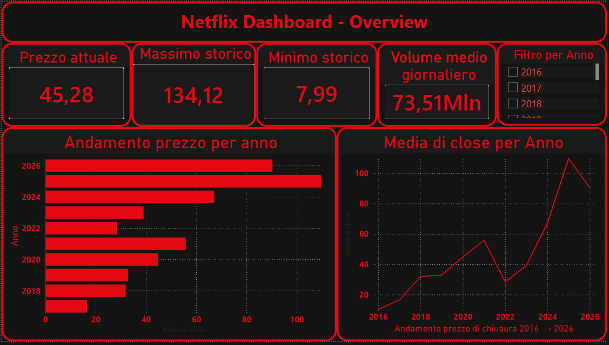
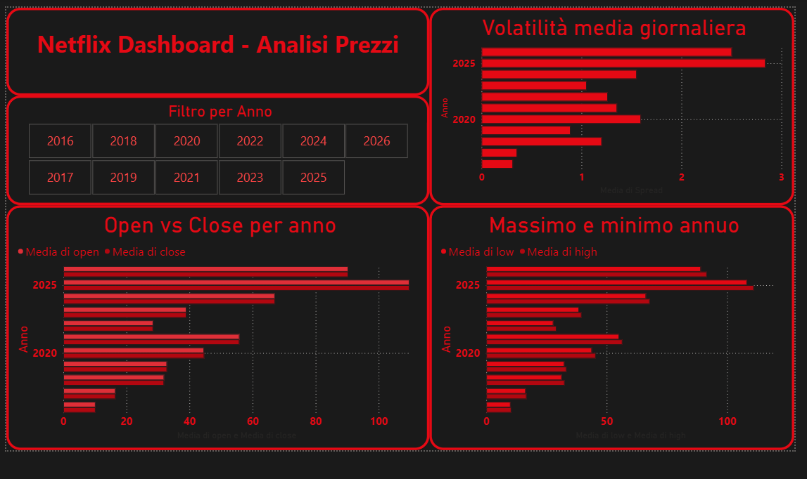
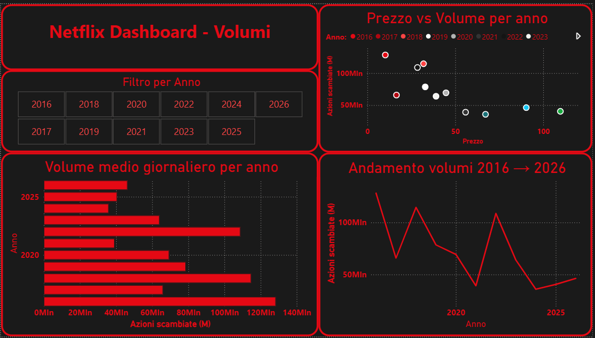

# Dashboard Vendite Power BI

## Panoramica del Progetto

Questo progetto consiste in una dashboard interattiva realizzata con Microsoft Power BI per analizzare dati di vendita. L'obiettivo principale è fornire una panoramica chiara delle performance di vendita, dei prodotti più performanti, delle categorie principali e dell'andamento temporale delle vendite.

Il progetto è stato creato come esercitazione pratica di Business Intelligence e Data Analytics, con focus su:

- Pulizia dei dati
- Modellazione dei dati
- Creazione di KPI
- Visualizzazioni interattive
- Storytelling tramite dashboard
- Utilizzo base di DAX

---

## Anteprima

| Overview | Analisi Prezzi | Volume |
|----------|---------------|---------------|
|  |  |  |

---

## Informazioni sul Dataset

Il progetto utilizza un dataset storico delle azioni Netflix (`NFLX`) contenente informazioni giornaliere sul prezzo del titolo e sul volume di scambio.

Dataset utilizzato:

- Netflix Stock Market Dataset (`NFLX.csv`)

Il dataset include:

- Prezzo di apertura
- Prezzo massimo giornaliero
- Prezzo minimo giornaliero
- Prezzo di chiusura
- Prezzo adjusted close
- Volume degli scambi
- Timestamp di ingestione dati

Fonte dataset:

- Kaggle


```text
https://www.kaggle.com/datasets/caesarmario/netflix-stock-historical-price
```

### Colonne del Dataset

| Colonna | Tipo Dato | Descrizione |
|---|---|---|
| Date | Data | Data della rilevazione giornaliera |
| open | Decimale | Prezzo di apertura |
| high | Decimale | Prezzo massimo giornaliero |
| low | Decimale | Prezzo minimo giornaliero |
| close | Decimale | Prezzo di chiusura |
| adjclose | Decimale | Prezzo adjusted close |
| volume | Intero | Volume totale degli scambi |

---

## Funzionalità della Dashboard

### KPI Principali

La dashboard include KPI per monitorare rapidamente:

- Vendite totali
- Quantità totale venduta
- Prezzo medio dei prodotti

---

### Analisi per Categoria

È presente un grafico a barre per confrontare le performance delle categorie.

Domanda business:

> Quale categoria genera più revenue?

---

### Analisi Prodotti

Una visualizzazione dedicata mostra i prodotti più performanti.

Domanda business:

> Quali prodotti contribuiscono maggiormente alle vendite?

---

### Analisi Temporale

Un grafico a linee mostra l'andamento delle vendite nel tempo.

Domanda business:

> Le vendite stanno aumentando o diminuendo?

---


## Strumenti Utilizzati

- Microsoft Power BI
- Power Query
- DAX (Data Analysis Expressions)
- Dataset CSV

---

## Struttura del Progetto

```text
project/
├── data/
│   └── NFLX.csv
├── screenshots/
│   ├── analisi_prezzi.png
│   ├── overview.png
│   └── volume.png
├── powerbi/
│   └── netflix_stock_dashboard.pbix
└── README.md
```

---

## Obiettivi di Apprendimento

Questo progetto è stato sviluppato per esercitarsi con:

- Data Visualization
- Fondamenti di Business Intelligence
- Progettazione dashboard
- Trasformazione dati
- KPI reporting
- Report interattivi con Power BI

---

## Autore

### Rocco Tarantino

github: https://github.com/RockyT98

